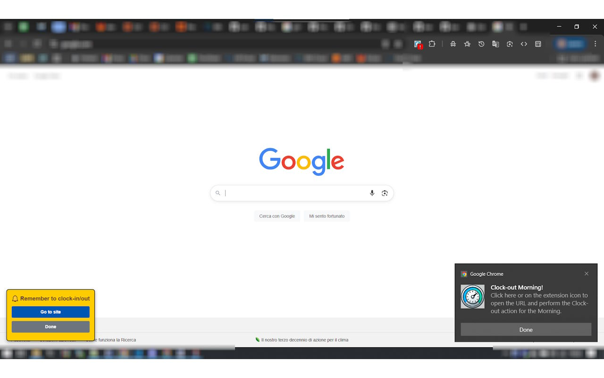
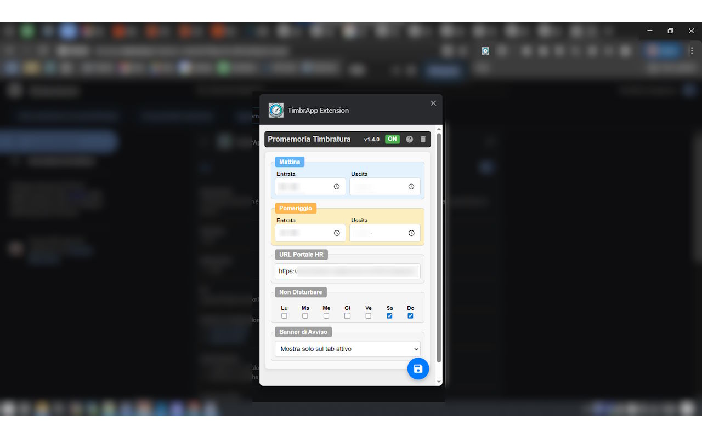
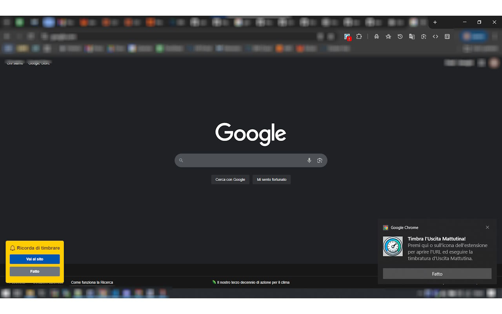
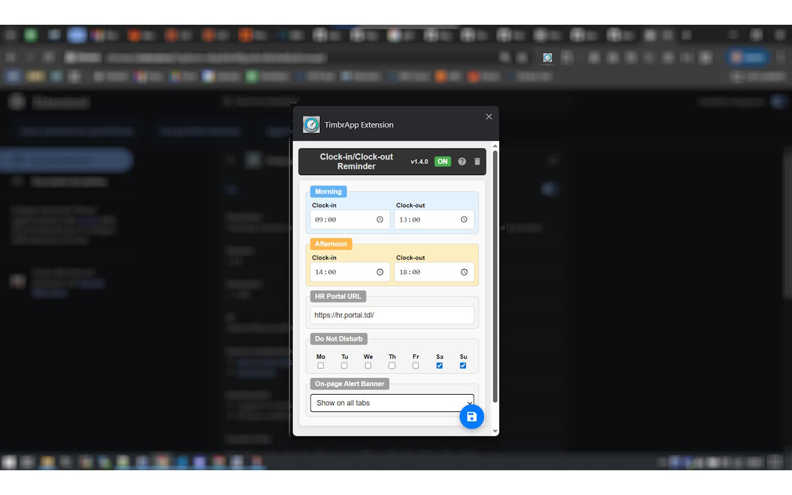

# TimbrApp Extension — Visual Guide

> This page is linked from the main [README](../README.md) and viewed directly on GitHub — it is not bundled inside the extension package, to keep it lightweight.

## English

### The reminder in action

When it's time to clock in or out, you get a browser notification and (optionally) an on-page banner with quick actions — go to your HR portal, snooze, or mark it done.

### Options page

Configure your morning/afternoon times, HR portal URL, Do Not Disturb days, and where the on-page banner should appear.

---

## Italiano

### Il promemoria in azione

Quando è ora di timbrare, ricevi una notifica del browser e (facoltativamente) un banner sulla pagina con azioni rapide — vai al portale HR, posticipa, o segna come fatto.

### Pagina delle opzioni

Configura gli orari di mattina/pomeriggio, l'URL del portale HR, i giorni "Non Disturbare" e dove far comparire il banner sulla pagina.

